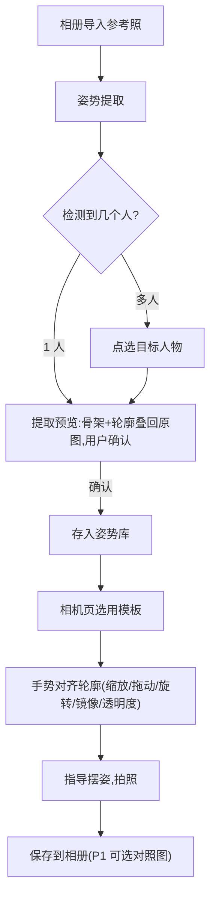

# 01 · 产品定义与 MVP 范围

## 1. 一句话定位

给"看到喜欢的照片想拍同款"的用户,一个能把参考姿势带进取景框的相机。

## 2. 目标用户与核心场景

- 主用户:18–35 岁、活跃于小红书/Instagram、拍照有"摆姿焦虑"的用户;以及负责按快门的"男朋友/闺蜜摄影师"。
- 场景 A(他拍,主场景):用户收藏了博主照片,把手机交给同伴,同伴按轮廓线取景并口头指导摆姿。
- 场景 B(自拍):前摄 + 镜像轮廓,用户自己对齐。
- 场景 C(多人合照):参考图里多个人,选其一提取(合照编排属 P1+)。

## 3. 核心用户旅程(MVP)

## 4. 功能分级

### P0 — MVP(缺一不可)

| # | 功能 | 要点 / 验收 |
| --- | --- | --- |
| 1 | 相册导入 | PhotosPicker 系统选图器,不索取整库权限;支持 JPEG/HEIC/PNG |
| 2 | 姿势提取 | 19 点骨架 + 人物外轮廓;提取预览页叠回原图供确认/重选 |
| 3 | 多人选择 | 检测到多于 1 人时,点选目标(实例分割高亮,iOS 17 API) |
| 4 | 姿势模板库 | 本地保存(骨架+轮廓+缩略图);列表、删除;空态引导 |
| 5 | 相机叠加 | 前/后摄;轮廓层支持:透明度滑杆、双指缩放、旋转、拖动、镜像开关、显示模式切换(轮廓/骨架/两者);双击重置 |
| 6 | 拍照保存 | AVCapturePhotoOutput 拍照 → 相册("仅添加"权限) |
| 7 | 失败兜底 | 未检出人物/关节不足/多人歧义的引导文案(见 03·§6) |

### P1 — 第一次迭代

- 内置姿势库(按场景分类:旅行/闺蜜/情侣/毕业照;素材必须有版权,见 04·§4)
- ~~"幽灵模式":参考原图整体半透明叠加(对齐背景构图用)~~ 已实现:导入页"保留参考原图"开关 + 相机页 `photo.on.rectangle.angled` 按钮;原图随模板存 `originals/`
- 成片 × 参考图对照分享卡片
- ~~网格线 / 水平仪~~ 已实现(九宫格 + 叠加旋转角偏差指示);~~模板重命名、收藏排序~~ 已实现(长按菜单 + 收藏置顶)
- ~~保存镜像自拍开关~~ 已实现:前摄时工具行出现镜像保存按钮;数据经 CGContext 水平翻转重编码(docs/03 §5)

### P2 — 差异化(单独立项再评审)

- 实时姿势匹配打分 + 达标自动快门 + 语音提示(设计草案见 03·§7)
- 手部 21 点细节;3D 姿态辅助机位提示
- Core AI + 自选强模型替换 Vision(触发条件见 04·§5.1)
- 姿势重定向:按被拍者身材比例变形参考骨架

## 5. 非目标(明确不做)

- 修图/美颜/滤镜:生态已饱和,不碰,导出交给用户常用工具
- 社区/UGC:V1 不做,先验证工具价值
- Android:iOS 验证通过后再启动(04·§5.2)
- 任何云端处理:隐私是卖点,MVP 甚至不发网络请求

## 6. 成功指标(上线后 4 周观察)

| 指标 | 目标 | 含义 |
| --- | --- | --- |
| 提取确认率 | ≥ 70% | 导入后确认入库的比例,衡量提取质量 |
| 导入→完成拍照转化 | ≥ 40% | 核心闭环是否跑通 |
| 相机页人均停留 | ≥ 90s | 是否真的在用轮廓对齐 |
| 次周留存 | ≥ 15% | 工具类基线,低于说明是伪需求(见 04·§4) |

注:MVP 无网络,上述指标先靠 TestFlight 反馈与本地日志导出粗测;正式版接入分析 SDK 前必须同步修改隐私标签(04·§3)。

## 7. MVP 整体验收标准

- 20 张标准测试集(04·§2)提取可用率 ≥ 80%,其中常规站/坐姿 100%
- iPhone 12 及以上:相机页稳定 60fps,连续取景 10 分钟无过热降频告警
- 全流程(导入→确认→对齐→拍照)新手 ≤ 60 秒
- 飞行模式全功能可用;抓包验证 App 零网络请求
