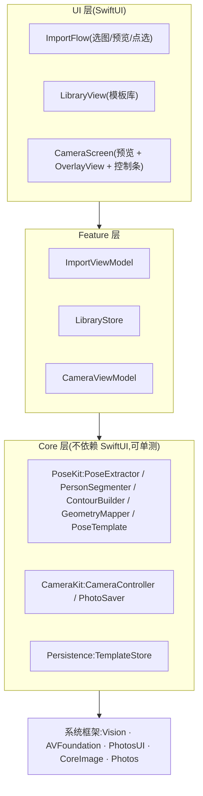

# 02 · 技术架构与选型

## 1. 关键决策(含理由与放弃项)

| # | 决策 | 理由 | 放弃了什么 / 代价 |
| --- | --- | --- | --- |
| D1 | 最低 iOS 17.0 | 多人实例分割 `VNGeneratePersonInstanceMaskRequest`、`@Observable`、`RotationCoordinator` 都是 17+;2026 年 17+ 覆盖率已足够 | 放弃 iOS 16 用户;若必须兼容,多人选择功能降级为"自动选最大人物"并把 `@Observable` 换回 ObservableObject |
| D2 | SwiftUI 为主,相机预览用 UIViewRepresentable 包 UIKit | 开发速度;预览层必须是 AVCaptureVideoPreviewLayer | 放弃纯 UIKit(无收益)与 Flutter/RN(相机核心体验要原生,且仅 iOS 单端) |
| D3 | Vision 框架承担全部 AI 能力 | 系统内置模型:零模型工程、零推理成本、离线隐私、不增包体 | 放弃 MediaPipe(iOS 单端引 C++ 依赖不划算)与 Core AI 自选模型(留作升级路径,04·§5.1);代价:模型黑盒、精度天花板不可控 |
| D4 | MVP 相机零逐帧推理 | 叠加层是静态矢量,用户手势对齐;60fps 稳、功耗低、老机型友好 | 放弃 V1 就做实时打分(P2 再做,03·§7 已预留接口) |
| D5 | 持久化 = Codable JSON + 文件 | 模板 < 几百条,一次性读入内存足矣;原子写防损坏 | 放弃 SwiftData/Core Data(迁移、并发、调试成本,零收益) |
| D6 | 零第三方依赖 | Vision/AVFoundation/PhotosUI/CoreImage 全覆盖需求 | 放弃现成 UI 库;P1 起按需评估 |
| D7 | 内部坐标只有一种表示 | 全部为 Vision 归一化坐标(左下原点);出 Core 层必须过 GeometryMapper(03·§4) | 代价:所有 UI 绘制多一次显式换算——这正是防 bug 的手段 |

## 2. 分层架构



依赖方向单向:UI → Feature → Core → 系统框架。Core 层禁止 import SwiftUI/UIKit(缩略图生成允许 ImageIO/CoreGraphics)。

## 3. 数据模型

```swift
/// 姿势模板:一次成功提取的全部产物。坐标一律为 Vision 归一化坐标(左下原点)。
struct PoseTemplate: Codable, Identifiable {
    let id: UUID
    var name: String
    let createdAt: Date
    /// 置信度达标的关节点(最多 19 个),key 见 03·§2
    let joints: [String: NormalizedPoint]
    /// 人物外轮廓多边形点串(已简化);渲染时做曲线平滑
    let contour: [NormalizedPoint]
    /// 参考图宽高比 w/h,叠加时保持比例
    let sourceAspect: Double
    /// 缩略图文件名(相对 thumbnails/ 目录)
    let thumbnailFile: String
}

struct NormalizedPoint: Codable, Hashable {
    var x: Double
    var y: Double
}

/// 相机页叠加变换,由手势驱动;随模板记忆最近一次使用值(可选)
struct OverlayTransform: Codable {
    var scale: Double = 1
    var rotation: Double = 0          // 弧度
    var offset: CGSize = .zero        // 视图坐标 pt
    var mirrored: Bool = false
    var opacity: Double = 0.6
    var style: OverlayStyle = .contour // .contour / .skeleton / .both
}
```

存储布局(`Application Support/PoseTrace/`):

```
templates.json          # [PoseTemplate],原子写(write(to:options:.atomic))
thumbnails/<uuid>.heic  # 长边 600px,列表展示用
```

隐私取舍:MVP 不保存导入原图(省体积 + 降低敏感度),缩略图仅用于库列表;P1 做"幽灵模式"时再增加"保留原图"开关,并在设置页提供一键清空。

## 4. 权限与隐私

| 项 | 方案 |
| --- | --- |
| 导入照片 | SwiftUI `PhotosPicker`:系统独立进程选图,**无需任何相册权限弹窗** |
| 相机 | `NSCameraUsageDescription`:"用于取景拍摄。画面仅在本机处理,不会上传或收集。" |
| 保存照片 | `NSPhotoLibraryAddUsageDescription`(仅添加级权限):"用于把拍摄的照片保存到你的相册。" |
| 隐私标签 | MVP 零网络、零三方 SDK → App Store 隐私标签如实勾选 **Data Not Collected**(一旦接分析/崩溃 SDK 必须同步修改) |
| 卖点表达 | 上架文案与 onboarding 明示"照片不离开设备" |

## 5. 工程结构(Xcode)

```
PoseTrace/
├── App/                    # 入口、路由、全局环境
│   ├── PoseTraceApp.swift
│   └── AppRouter.swift
├── Features/
│   ├── Import/             # 选图、提取进度、预览确认、多人点选
│   ├── Library/            # 模板列表、删除、空态
│   └── Camera/             # CameraScreen、OverlayView、手势状态、控制条
├── Core/
│   ├── PoseKit/            # PoseExtractor、PersonSegmenter、ContourBuilder、
│   │                       # GeometryMapper、Skeleton(拓扑定义)、PoseTemplate
│   ├── CameraKit/          # CameraController(会话生命周期)、PhotoSaver
│   └── Persistence/        # TemplateStore(JSON + 缩略图文件)
├── Resources/              # Assets、Localizable(文案集中管理)
└── Tests/
    ├── PoseKitTests/       # 20 张 fixture + 期望 JSON(金标准,04·§2)
    └── GeometryMapperTests/
```

- 构建:Xcode ≥ 16 / Swift ≥ 5.10;Target = App + UnitTests;无外部 SPM 包。
- 文案集中在 Localizable 便于后续多语言(出海时英文市场是加分项)。

## 6. 并发模型

- 提取管线:`Vision` 的 `perform` 是同步阻塞调用 → 包在后台执行(`Task.detached` 或专用串行队列),对 UI 暴露 `async throws` 接口;整图提取在导入时一次性完成,无并发竞争。
- 相机:`AVCaptureSession` 的配置与启停放在专用串行 `sessionQueue`(Apple 推荐做法);对外状态经 `@MainActor` 发布。
- UI 状态:`@Observable` ViewModel(iOS 17)。
- 规则:Core 层类型要么是纯值类型,要么明确标注所属执行环境;禁止在 Core 层触碰主线程假设。
