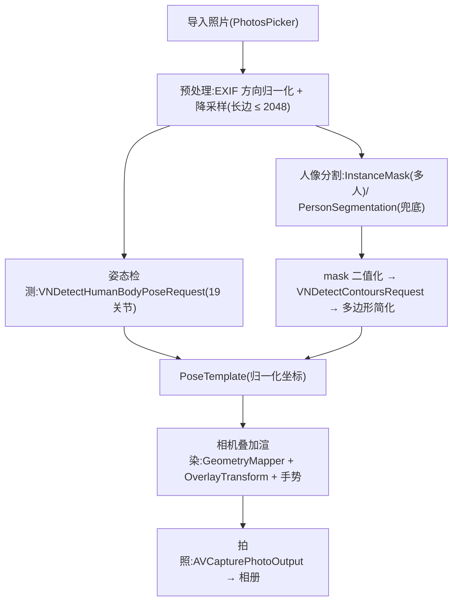

# 03 · 核心管线实现

> 本篇代码均为**示意骨架**:签名与调用顺序可直接采用,细节(错误分支、参数微调)以 Xcode 实测为准。



## 1. 导入与预处理

1. `PhotosPicker` → `PhotosPickerItem.loadTransferable(type: Data.self)` → `UIImage`。
2. **方向归一化**:用 `UIGraphicsImageRenderer` 重绘为 `.up` 方向;此后所有处理基于像素坐标,规避 EXIF 方向与 Vision `orientation` 参数的组合错误(高频 bug 源)。
3. **降采样**:ImageIO `CGImageSourceCreateThumbnailAtIndex`,长边 ≤ 2048px——姿态/分割精度无感知差异,内存与耗时显著下降。
4. 产出 `CGImage` 供全部 Vision 请求复用(同一 handler 可一次 perform 多个 request)。

## 2. 姿态检测(骨架)

```swift
func detectPose(in image: CGImage) throws -> [String: CGPoint] {
    let request = VNDetectHumanBodyPoseRequest()
    let handler = VNImageRequestHandler(cgImage: image)
    try handler.perform([request])
    guard let obs = request.results?.first else { throw ExtractError.noPerson }
    var joints: [String: CGPoint] = [:]
    for (name, point) in try obs.recognizedPoints(.all) where point.confidence > 0.2 {
        joints[name.rawValue.rawValue] = point.location   // 归一化,左下原点
    }
    return joints
}
```

**19 关节点(VNHumanBodyPoseObservation.JointName)**:

| 部位 | 关节 |
| --- | --- |
| 头 | nose, leftEye, rightEye, leftEar, rightEar |
| 躯干 | neck, root(髋中点), leftShoulder, rightShoulder, leftHip, rightHip |
| 臂 | leftElbow, rightElbow, leftWrist, rightWrist |
| 腿 | leftKnee, rightKnee, leftAnkle, rightAnkle |

**骨架连线定义(Skeleton.swift,渲染与 P2 打分共用同一份)**:

```
头:   nose–neck, nose–leftEye, nose–rightEye, leftEye–leftEar, rightEye–rightEar
躯干: neck–leftShoulder, neck–rightShoulder, neck–root, root–leftHip, root–rightHip
臂:   leftShoulder–leftElbow, leftElbow–leftWrist(右侧对称)
腿:   leftHip–leftKnee, leftKnee–leftAnkle(右侧对称)
```

- 置信度阈值 0.2 起步,M0 用测试集校准。
- 质量门槛:可用关节 < 8 → 判"质量不足";缺失全部下肢 → 标注"半身姿势"仍允许入库(半身参考同样有价值)。
- 多人:request 返回多个 observation;与分割实例的配对方法——取关节点集中落在某实例 mask 内比例最高者。
- 已知边界:海报/雕塑等"人形"也会被检出,由提取预览页的人工确认兜底。

## 3. 人像分割与轮廓矢量化

**两级策略**:

- 首选(iOS 17+):`VNGeneratePersonInstanceMaskRequest`(≤ 4 人)。用户点选:对 `instanceMask` 像素买点采样(tap 点 → 实例编号),`generateMask(forInstances:)` 得到目标 mask。
- 兜底(单人/实例请求失败):`VNGeneratePersonSegmentationRequest`,`qualityLevel = .accurate`(导入是一次性操作,用最高档),`outputPixelFormat = kCVPixelFormatType_OneComponent8`。

**mask → 矢量轮廓**:

```swift
func contour(from mask: CVPixelBuffer) throws -> [CGPoint] {   // 归一化点串
    var ci = CIImage(cvPixelBuffer: mask)
    ci = ci.applyingFilter("CIColorThreshold", parameters: ["inputThreshold": 0.5]) // 二值化,消灰边锯齿
    let request = VNDetectContoursRequest()
    let handler = VNImageRequestHandler(ciImage: ci)
    try handler.perform([request])
    guard let obs = request.results?.first,
          let outline = obs.topLevelContours.max(by: { $0.pointCount < $1.pointCount })
    else { throw ExtractError.noContour }
    let simplified = try outline.polygonApproximation(epsilon: 0.004)
    return simplified.normalizedPoints.map { CGPoint(x: CGFloat($0.x), y: CGFloat($0.y)) }
}
```

- 取"最大顶层轮廓"作为人形外轮廓(以点数近似面积,必要时改用 boundingBox 面积)。
- `epsilon` 经验区间 0.003–0.008:越大越概括、越小越贴身;M0 拿测试集目测定值,并作为设置项隐藏入口保留。
- 内轮廓(手臂-躯干之间的洞)MVP 忽略,只描外轮廓,视觉更干净;P1 可加"细节模式"(遍历 childContours)。
- 存储存**简化后的点串**;渲染时用 Catmull-Rom 样条平滑成曲线。

## 4. 坐标系统一(GeometryMapper)——最容易出 bug 的一层

三个坐标系:**Vision 归一化**(左下原点,y 向上)/ **图像像素**(左上原点)/ **SwiftUI 视图**(左上原点,pt)。

规则(对应 02·D7):

1. Core 层与持久化:一律 Vision 归一化坐标。
2. 进 UI 必须经 `GeometryMapper.toView(_:viewSize:contentAspect:transform:)`:翻转 y → 按 `sourceAspect` 在视图内 aspect-fit 内接 → 应用 OverlayTransform(镜像/缩放/旋转/位移)。全部纯函数。
3. P2 实时帧的点转换用 `AVCaptureVideoPreviewLayer.layerPointConverted(fromCaptureDevicePoint:)`,**绝不手写** resizeAspectFill 的裁剪换算。
4. 前摄镜像:预览默认镜像。轮廓 mirror 开关的默认值——自拍模式**开**(用户是"照镜子"心智),后摄**关**;用户可随时切。
5. 单元测试:方向 × 镜像 × aspect 的用例矩阵全覆盖(04·§2),这是回归重灾区。

## 5. 相机与叠加渲染

**CameraController(CameraKit)**:

- `AVCaptureSession`(`.photo` preset)+ `builtInWideAngleCamera`(前/后)+ `AVCapturePhotoOutput`。
- 所有配置/启停在专用串行 `sessionQueue`;页面 onAppear 启动、onDisappear 停止。
- 旋转:iOS 17 `AVCaptureDevice.RotationCoordinator` 驱动预览与拍照方向。
- MVP **不挂** `AVCaptureVideoDataOutput`(P2 才需要),这是功耗与发热优势的来源。

**预览层**:`UIViewRepresentable` 包一个 `layerClass = AVCaptureVideoPreviewLayer` 的 UIView,`videoGravity = .resizeAspectFill`。

**OverlayView(SwiftUI)**:

- 输入:`PoseTemplate` + `OverlayTransform`;Canvas 绘制(轮廓与骨架均为矢量 Path)。
- 初始摆放:轮廓包围盒高 = 取景高度 70%,水平居中——"拿起来就能用"的默认值。
- 描边样式:主线 2.5pt 白 + 外圈 1pt 黑(或投影),保证亮/暗背景可见;骨架线用青色系区分;虚线样式可选。
- 手势:`MagnifyGesture` + `RotateGesture` + `DragGesture` 组合(`simultaneously`),双击重置为初始摆放;透明度滑杆范围 0.3–0.8。
- 状态栏提示当前模板名 + "换姿势"快捷入口(回库列表)。

**拍照**:`capturePhoto` → `PHPhotoLibrary`(add-only)保存原片;P1 增加对照分享卡片(`UIGraphicsImageRenderer` 合成成片 + 参考缩略图 + 轮廓)。

## 6. 提取预览与失败兜底

- 提取完成 → 预览页:原图上叠画骨架 + 轮廓;多人先弹实例点选(mask 高亮)。用户确认才入库——人工把关是 MVP 最便宜的质量闸门。
- 统一错误类型 `ExtractError`,文案表:

| 错误 | 文案(示意) |
| --- | --- |
| noPerson | 没有识别到人物。换一张人物完整、清晰的照片试试。 |
| lowQuality | 只识别到部分身体,轮廓可能不完整。可以继续使用,或换一张全身照。 |
| ambiguousMultiPerson | 照片里有多个人,点选你要参考的那一位。 |
| noContour | 人物轮廓提取失败(背景太复杂或对比度低),已保留骨架线可用。 |

- 本地日志记录失败类型分布(仅设备内文件,可从设置页导出)——为 04·§5.1 的 Core AI 升级决策攒证据。

## 7. P2 · 实时匹配设计草案(本期不实现,只预留接口)

- 数据源:`AVCaptureVideoDataOutput`,节流 15fps,`alwaysDiscardsLateVideoFrames = true`。
- 每帧 `VNDetectHumanBodyPoseRequest`(注意传设备方向)。
- 归一化:root 平移至原点,按 neck–root 距离定尺度;比较 12 条肢体骨骼向量的方向角差。
- 得分 = Σ wᵢ·cos(Δθᵢ) 映射 0–100(四肢权重 > 头部);EMA(α ≈ 0.3)平滑防跳变。
- ≥ 85 分持续 1s → 轮廓变绿 + 触觉反馈 + 可选自动快门。
- **现在就做的预留**:`PoseComparator` 按上述接口设计为纯函数模块(可先落单测),P2 只接数据源;`CameraController` 的输出协议预留帧回调口。
- 能耗守则:匹配默认关;开启时预览降到 30fps;`ProcessInfo.thermalState ≥ .serious` 自动关闭并提示。

## 8. 性能预算(以 iPhone 13 / A15 为基准,M0 实测后修订)

| 项 | 预算 |
| --- | --- |
| 导入→模板生成全流程 | ≤ 1.5s(姿态 ~50ms + accurate 分割数百 ms + 轮廓 ~10ms + IO) |
| 相机页帧率 | 稳定 60fps(叠加层零逐帧计算) |
| 手势响应 | < 16ms(纯 transform,不重建 Path) |
| 内存峰值(提取期) | < 250MB |
| 快门→保存完成 | < 1s |
